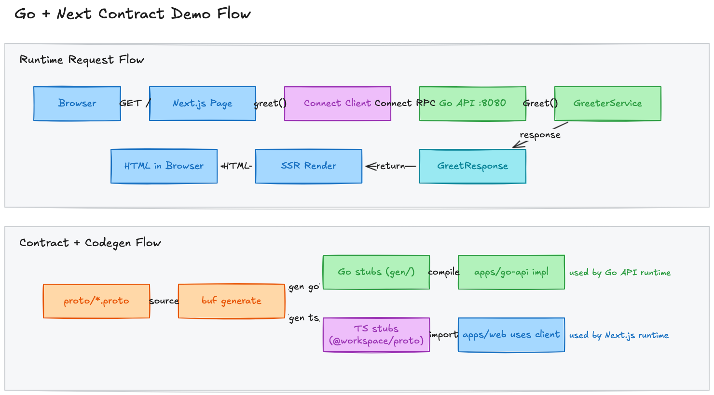

# go-next-contract

A practical monorepo starter for learning **Go + Next.js contract-first development** with Protobuf + Connect RPC.

## Stack

- `apps/web`: Next.js 16 app router
- `apps/go-api`: Go HTTP server with Connect RPC handlers
- `proto/`: `.proto` contracts + Buf config
- `packages/proto`: generated TypeScript protobuf descriptors
- `packages/ui`: shared shadcn/ui components

## Quick start

```bash
pnpm install
pnpm proto:generate
pnpm dev
```

`pnpm dev` runs both `web` and `go-api` via Turborepo.

## RPC flow

1. Define API in `proto/api/v1/*.proto`
2. Run `pnpm proto:generate`
3. Implement handler in `apps/go-api/internal/service`
4. Consume typed client in `apps/web`

## Demo flowchart

- Excalidraw source: `docs/excalidraw/demo-flowchart.excalidraw`
- Exported PNG: `docs/excalidraw/demo-flowchart.png`



## Useful commands

```bash
# generate Go + TS files from proto
pnpm proto:generate

# quality gates
pnpm lint
pnpm typecheck
pnpm build
```

## Runtime env

- `GO_API_ADDR` (default `:8080`) controls Go API listen address
- `GO_API_BASE_URL` (default `http://localhost:8080`) controls Next.js RPC target
